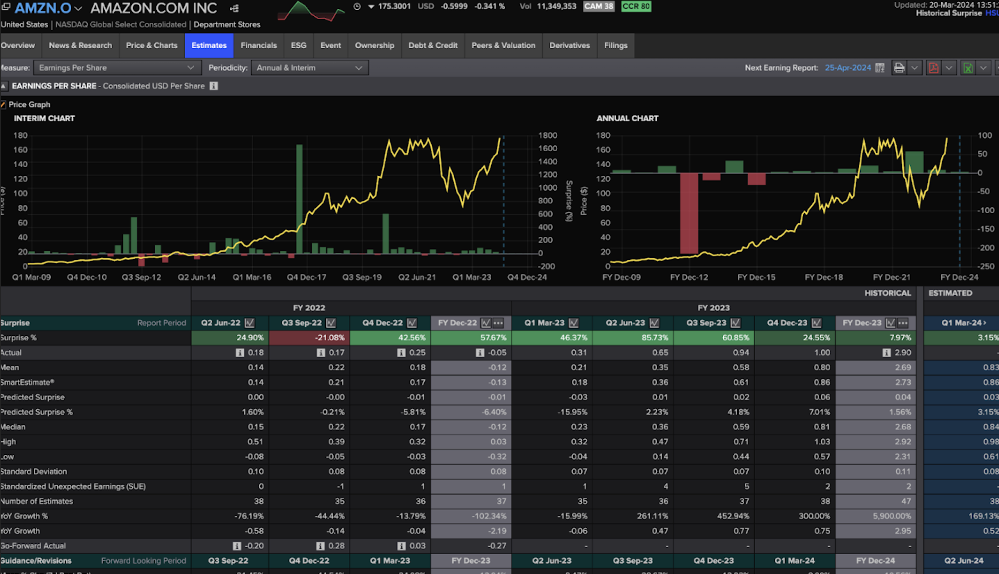

### Concise Tech Report
*Full data (before cleaning): https://drive.google.com/drive/u/1/folders/17O7OPPyqmtizORDlokelunva8B26hpOp
Sample data (before cleaning): one of 19 CSV files. https://drive.google.com/file/d/1n1jW5U06dh2Yd4zfd96AS_UUXDpEHDt2/view?usp=drive_link
 *

- **How many data points are there in total?**
1064 entries tracking the evolution of our parameters of interest. 

- **Do you think this is enough data to perform your analysis later on?**
Yes. We want the focus of our analysis to be based the most influential companies in the stock market, and so using data from the top 25 companies in the S&P with 56 dated entries of different stock attributes.

- **Where and how did you collect the data?**
LSEG Refinitiv datasets. We logged into the portal and downloaded xlsx files for each company’s dataset. Then, using Excel, we converted the data into csv format. This gave us 19 individual CSV files. 

 

- **Is the source reputable?**
According to LSEG Refinitiv, “Our [...] tool enables you to view economic data as it was reported on release [...] with a value accuracy rate of 99.85%”. Headlines are updated two to three minutes after their release time for time series data. Our database is therefore up to date and highly accurate. 

- **How did you generate the sample? Is it comparably small or large? Is it representative or is it likely to exhibit some kind of sampling bias?**
We collected the data from the top 25 tickers on S&P 100. It is representative because large market cap companies are less sensitive to idiosyncratic (company-specific or unknown factors) effects on price reactions to earnings. The companies also represent a broad range of industries, which homogenize out industry-specific idiosyncrasies.

- **Are there any other considerations you took into account when collecting your data? This is open-ended based on your data; feel free to leave this blank.**
The data is publicly available, and LSEG is the professional channel for research on such data. The data is not skewed in any direction because, as I have checked with actual price numbers, the data is an accurate recording of earnings and price changes.

- **How clean is the data? Does this data contain what you need in order to complete the project you proposed to do?**
Our cleaning process can be observed more closely in `json/data_cleaner.py`. We have only collected historical information between 2009 and 2023 (not considering values representing 2024 predictions). We have converted percentages into float values, have replaced all values with no data with the default value of 0, and we have only assembled data from parameters that are interesting to us (specifically, the following values: Surprise %, Actual, Mean, SmartEstimate®, Predicted Surprise, Predicted Surprise %, Median, High, Low, Standard Deviation, Standardized Unexpected Earnings (SUE), Number of Estimates, YoY Growth %, YoY Growth)

- **How did you check for the cleanliness of your data?**
We have manually checked that all companies’ data is complete: Quarterly data from 2009 to 2023 with no irregular numbers for any of the quarters or attribute values, with limited amounts of missing information.

- **Did you implement any mechanism to clean your data? If so, what did you do?**
We have implemented filters on our data provider portal (LSEG Refinitiv Datastream), filtering for: 2009 to 2023 data and quarterly data. 
We were able to open this data in an Excel spreadsheet. Excel has a built-in feature where we can export excel files into CSV. This created 19 different CSVs representing different companies’ information.
We then used our python script `json/data_cleaner`.py to further clean and combine our multiple CSV files into a singular JSON file. 

- **Are there missing values? Do these occur in fields that are important for your project's goals?**
We have replaced missing values with a neutral number of 0, since the missing data only occurs for entries with range [-1, 1]. These are insignificant enough that we can still observe overall trends with the data. Within the 25 top S&P companies, there were 6 companies with significant data omissions that we have chosen not to include in our dataset.

- **Are there duplicates? Do these occur in fields that are important for your project's goals?**
There are no duplicate entries for a single company. Our uncleaned CSV data reflects this, since each file is unique. 
How is the data distributed? Is it uniform or skewed? Are there outliers? What are the min/max values? (focus on the fields that are most relevant to your project goals)

- **How is the data distributed? Is it uniform or skewed? Are there outliers? What are the min/max values? (focus on the fields that are most relevant to your project goals)**
The data is skewed to the right as companies tend to have positive earnings surprises (because analysts tend to be more conservative in their estimations and CEOs tend to want positive earnings surprise streaks). Earnings surprises center around 1% (not too high because the company’s management team is generally required to forecast accurately and to report actual earnings surprises accurately).
There are a few outliers when a company’s stock outperforms market expectations by 50% due to unexpectedly high demands. There’s 1 extreme outlier: JPMorgan’s earnings in 2009Q2 exceeded expectations by 588.5% (which is due to irrationally low analyst expectations).
Max: 588.5%; min: -42.7%

- **Are there any data type issues (e.g. words in fields that were supposed to be numeric)? Where are these coming from? (E.g. a bug in your scraper? User input?) How will you fix them?**
There are no datatype issues. Everything is easily converted to numerical values.

- **Do you need to throw any data away? What data? Why? Any reason this might affect the analyses you are able to run or the conclusions you are able to draw?**
There were 6 companies out of the 25 top S&P companies that didn’t have reportable numbers between 2009 and 2023 because they were not public during such time (so can’t report the numbers). I believe the omission is not a significant loss to our project goals. It is however possible that these companies chose not to have released their data publicly because it showed negative trends that would have dissuaded potential investors from investing in their company. If the trends in our data are overwhelmingly positive, this may explain why. With that said, we are still representing over 75% of the top 25 companies in the S&P 500, which seems sufficient to tease out trends and provide plausible analysis. 

- **Summarize any challenges or observations you have made since collecting your data. Then, discuss your next steps and how your data collection has impacted the type of analysis you will perform. (approximately 3-5 sentences)**
I found that our data is surprisingly quite clean (consistent with actual stock prices and earnings values with few errors; consistent with themselves) and mostly complete (no missing data/duplicates).
I realize that I may need to incorporate more than just “earnings per share surprises” as exogenous variables. I may also want values such as “earnings per share YoY growth” because the stock market is very sophisticated and previously embedded stock information influences how they react to earnings surprises.
